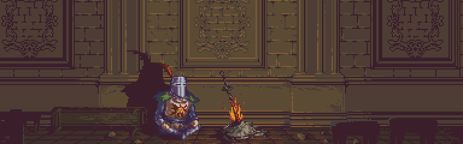

Sou estudante de **Desenvolvimento de Sistemas** na **Etec de Guaianases - Centro Paula Souza**, atualmente focado em aprender e evoluir como desenvolvedor, com interesse especial nas áreas 
de **back-end** e **banco de dados**, mas também explorando o universo do **front-end**.

---
 

## 💻 Tecnologias e Conhecimentos

### 🧠 Lógica e Fundamentos

 
<pre align="left">
 - Lógica de Programação – a base fundamental para entender qualquer linguagem; praticando resolução de problemase pensamento 
  computacional.
</pre>

### 🗃️ Banco de Dados

 
<table>
  <tr>
    <td>
    
    </td>
    <td>
  <pre align="left">
  Banco de Dados – aprendendo modelagem, fazendo consultas com SQL e organizando dados de 
  forma eficiente.
  </pre>
    </td>
  </tr>
</table>

### 🖥️ Front-end

 
<table>
  <tr>
    <td>
     
 

   

    </td>
    <td>
    <pre align="left">   
   HTML & CSS – criando e estilizando páginas web, aprendendo a montar layouts 
   responsivos e estruturas bem organizadas.
       
   JavaScript – estudando a linguagem para adicionar interatividade às páginas, criar 
   funcionalidades dinâmicas e entender seu papel no front-end.
      </pre>
    </td>
  </tr>
</table>

### ⚙️ Back-end / Linguagens de Programação

 
<table>
  <tr>
    <td>

 
    

    

    

    </td>
    <td>
      

      <pre> 
  Python – minha linguagem principal no momento; estou focando em projetos, automações e 
  aprofundando a lógica com ela. 
    
  C++ – explorando conceitos mais profundos como ponteiros, manipulação de memória e 
  programação de alto desempenho.  
     
  Java – estudando desenvolvimento orientado a objetos, com foco em boas práticas, 
  estruturação e aplicações multiplataforma.
      </pre></pre>
      
  
    </td>
  </tr>
</table>

---

### 📊 Estatísticas

 

  

 

---

### 📫 Contato

 
<table>
  <tr>
    <td>     
  
    </td>
    <td>
      <pre>
Achou algo legal❔Tem uma dúvida ou sugestão❔Bora bater um papo‼
Me chama aqui ⬇
      </pre>

   
   
   

    </td>
  </tr>
</table>
 

